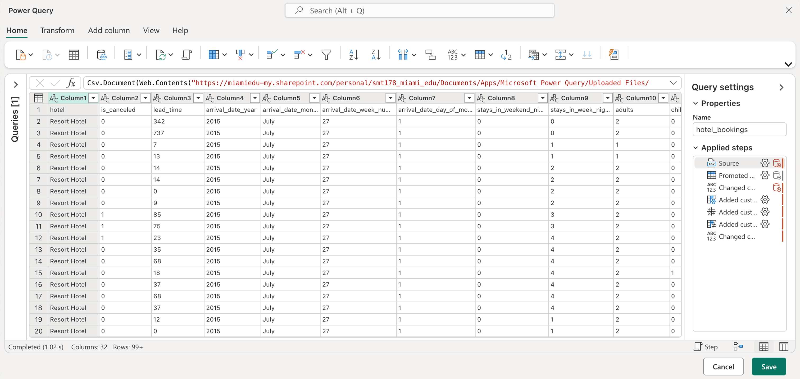

# Hotel Operations KPI Dashboard

Hospitality analytics project using a real Kaggle dataset — 119,390 hotel reservations across a City Hotel and Resort Hotel in Portugal (2015–2017). Built this because a lot of my background is in that space and I wanted something that reflects that.

**Live** [samuelthenm.github.io/hotel-booking-analytics](https://samuelthenm.github.io/hotel-booking-analytics)

# Data

Source: [jessemostipak/hotel-booking-demand](https://www.kaggle.com/datasets/jessemostipak/hotel-booking-demand) — 119,390 rows × 32 columns.
 
Both files are in `data/` — the raw CSV as downloaded from Kaggle and the cleaned version after running the queries in `sql/queries.sql`.

** What I explored **

Revenue and ADR by hotel type, monthly trends, market segment performance, cancellation rate by lead time, top booking countries, and customer type reliability.

# Cleaning (SQL)

Nulls filled, bad ADR values removed, added `total_nights` and `revenue` columns, fixed month sort order. All in `sql/queries.sql`.

# Stack

SQL · Power BI · DAX · Advanced Excel

## PowerBi Preview

[Samuel Then](https://linkedin.com/in/samuel-then) · Data Analyst
